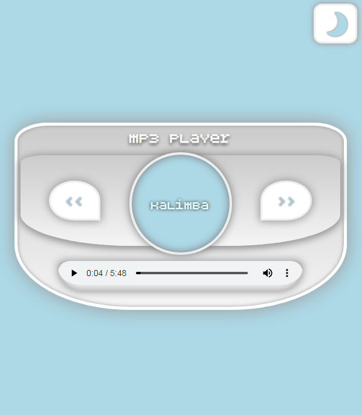
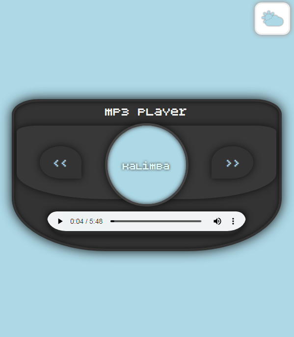
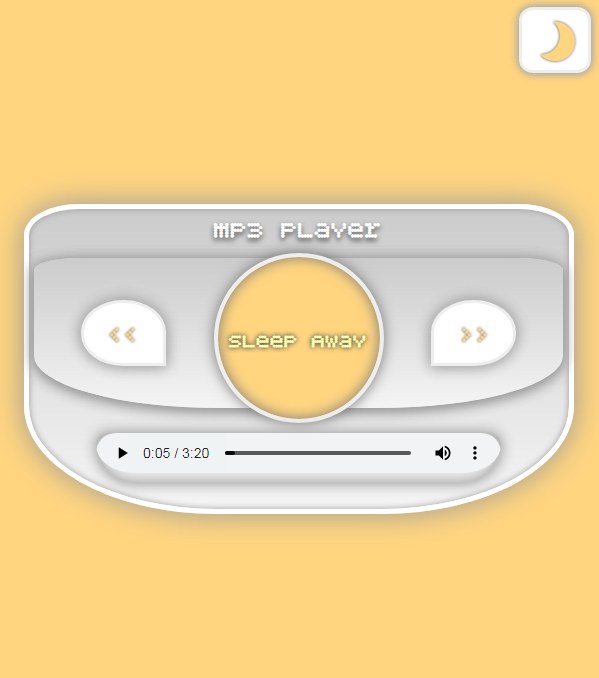
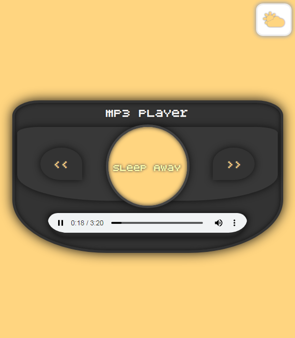
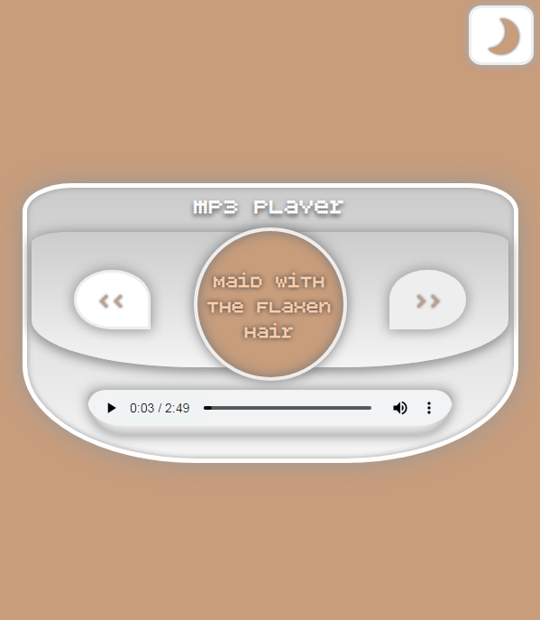
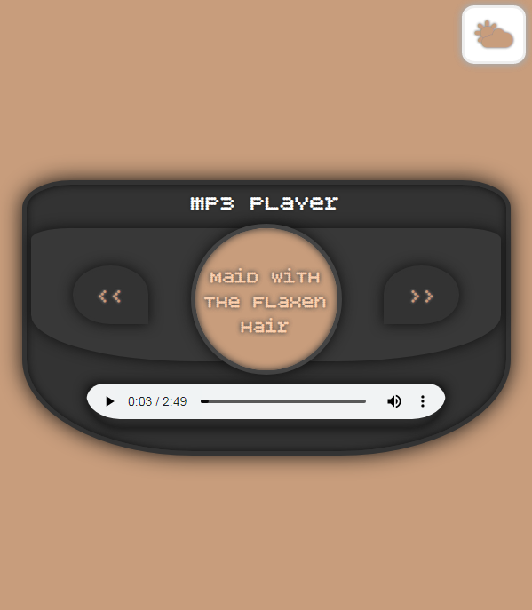

# mp3-player

The mp3 player app. Every song has its own color.

The background color slides into a different color by changing the music title.

We also have the option to select a dark theme by clicking on the button in the corner.

